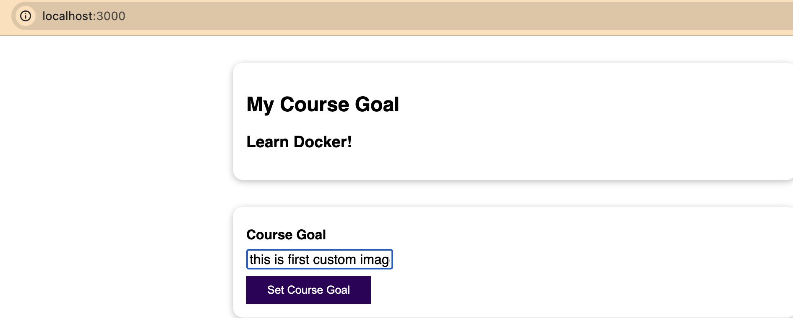
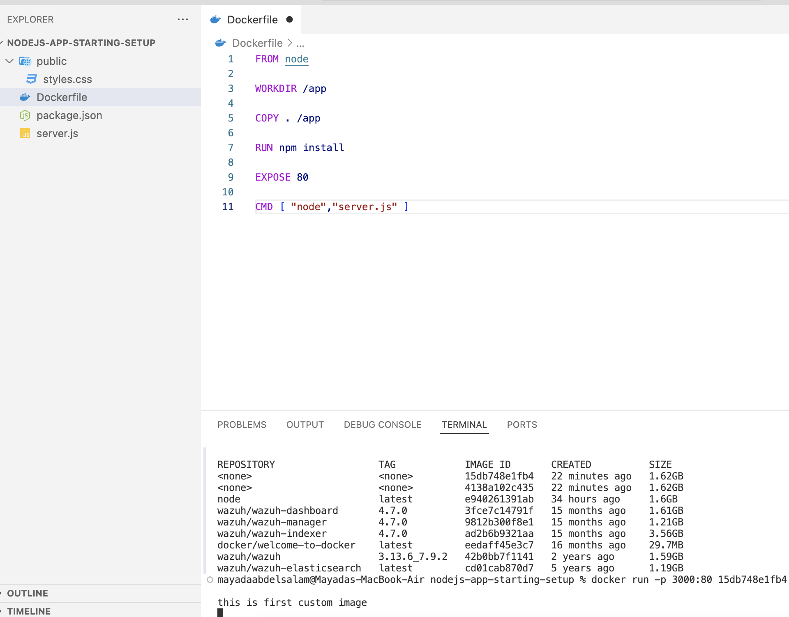
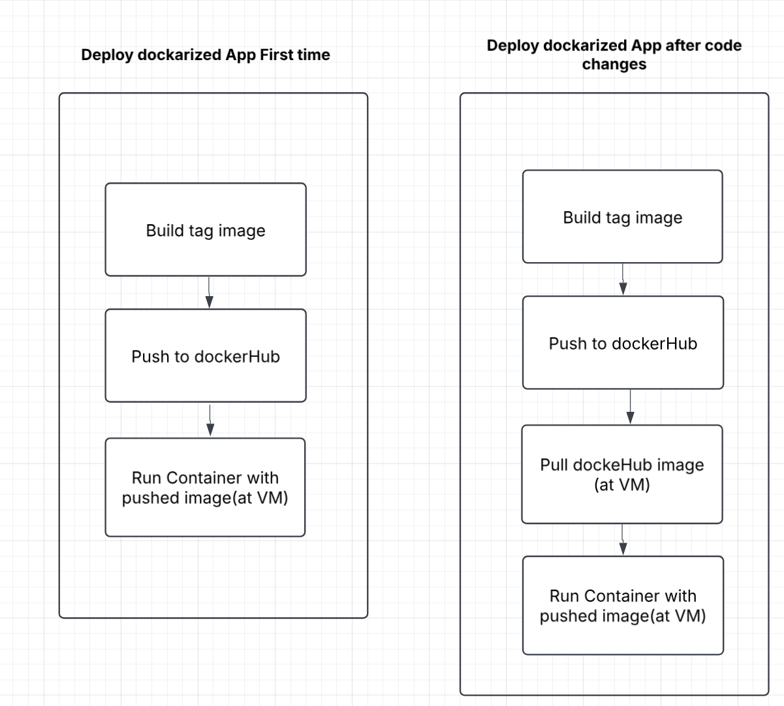

# DockerLearning
- **Project Overview**
- **Project Structure**
- **Build image and run container**
- **Managing images and containers**
- **Deploy dockerized App on cloud**

# Docker Learning

A project documenting my learning journey from the Udemy course Docker & Kubernetes

📌 **Project Overview** 
This repository tracks my hands-on experience and trials while learning Docker and Kubernetes.

This project is simple Web Application executed using Node.js that bring up node web server that listening on port 80 and handle incoming requests to URL

It contains two requests : 

**Get** request ,in which case defined HTML code will be returned.

**Post** request ,to store a goal where we then try to retrieve it, and log this goal value to the console.

We will **build** docker file for this project that build image ,then **run** containers locally and on cloud 

Also will check how to **manage** images and containers

And finally we will **deploy** these containers on cloud 

📂 **Project Structure**

  │── dockerLearning/  
  
    ├── nodejs-app-starting-setup 
     ├── Dockerfile                        # Docker configuration
     ├── public/                  
       ├── styles.css/                     # Application web format
     ├── package.json                      # Dependencies
     ├── server.js                         # Application source code  
     ├── images                            # Readme images 
    ├── README.md                          # Project details

 🎯 **Build image and run container**

First ,we create docker file that contains the setup instructions for our image and save it.

Open project terminal to build image after create new file `Dockerfile` in the current directory (`.`)

`docker build .`

make sure you are login is authenticated by this command 

`docker login`

Lists all Docker containers running and stopped 

`docker ps -a`

 Lists all Docker images available on the machine , then get the image_ID

`docker images`

Create and run container from the previous created Docker image and **maps ports**

`docker run -p 3000:80 image_ID`

then Open web browser : http://localhost:3000/

Enter “this is the first custom image”value in the course Goal text field and press “Set course Goal” as shown below ,the entered text will be shown at the console as well

The console output:

To stop running image , get the container_ID

`docker ps` 

`docker stop container_ID`

📚 **Managing images and containers**

To restart stopped container 

`docker start container_ID`

To remove old stopped containers 

`docker rm container_ID1 container_ID2 container_ID3 container_ID4`

To remove all local images(Note: need to stop all containers first so the image wont be assign and can be deleted successfully )

`docker image prune -a`

To remove specific image (Note: you need to remove container first then remove image )

`docker rmi image_ID1 image_ID2 image_ID3`

To remove container automatically after it stopped

`docker run --rm image_ID1` 

To get more details about the created image ( like:entry point, environment variable, Config ,OS )

`docker image inspect image_ID`

To copy files form local machine to containers or vice versa (ex:download container’s log files to ur local machine)

`docker cp SourceFileName/.  container_ID:/DestinationFileName`

To assign name to container 

`docker run —name  NewName image_ID`

To assign name to images (Consider "node:14". It's the "node" image containing a NodeJS setup) and then the v14-specific version of that image)

`docker build -t name:tag  .`

To rename image (clone old image with new name ,both images will be still there)

`docker tag oldName:oldTag newName:newTag`

☁️ **Docker deploy on cloud**

Spin up EC2 on AWS and configure ssh connection 

**note** : save key pair (keypair.pem)file inside the project folder 

at the local project terminal , change key permission

`chmod 400 keypair.pem`

Connect using ssh command line from instance connection steps at AWS

`ssh -i "keypair.pem" instancename`

Now we are connected to EC2, install docker at the VM 

 `sudo yum update -y
  sudo yum -y install docker 
  sudo service docker start` 

We will push our local image to dockerHub so we can pull it from anywhere

Create new repo at dockerHub and copy push command from there 

Open new terminal and build new image locally 

`docker build -t local_image_name .`

Change image tag to repo name

`docker tag local_image_name repo_name`

Push this image to dockerHub

`docker push repo_name`

Run container at AWS EC2 instance

`sudo docker run -d —-rm -p 80:80 repo_name`

Face error due to local machine architecture (arm64),solved by this command 

`sudo docker run --platform linux/arm64 -d -p 80:80 repo_name`

🌟 **Contributing**

This is a personal learning project, but feel free to open an issue or suggest improvements.
